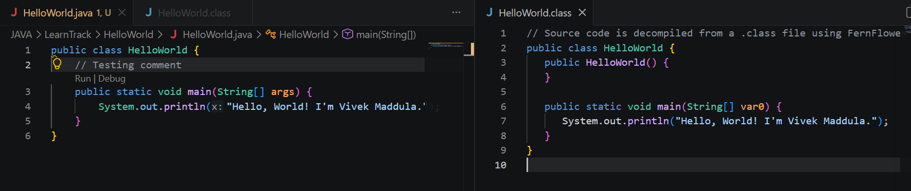

**What is JDK, JRE, JVM**

1. JDK i.e Java Development Kit is used to Java coding i.e write, compile and debug with inbuilt compiler and debugger.

2. JRE i.e Java Runtime Environment is the runtime package that provides the JVM (i.e virtual machine) and the Java libraries we use at runtime

3. JVM i.e Java Virtual Machine is the machine i.e engine that actually runs bytecode, manages memory, handles garbage collection.

The JDK helps you build the program, the JRE provides what it needs to run, and the JVM is what actually executes it.

To tell exactly the .java file will not run directly, first we compile it and get the bytecode ready (i.e stored in .class file) and the virtual machine(JVM) that actually runs/executes the byte code.

**What is bytecode**

Bytecode is the compiled code of .java code user coded with actual syntax, logic and comments. When JDK compiles it, the code is compiled into byte code i.e binary code that only machine can interpret. 

If you open the .class in IDE we can ibserve the decompiled verion of bytecode with actual structure where it executes in JVM. If you observe the below image, the .java file has comment and .class has default constructor and comment removed which explains what bytecode is i.e a perfectly compiled code of the .java coded by user in binary code i.e ready to execute by JVM.

**What does “write once, run anywhere” mean (1–2 short paragraphs)**

*Write once* here means that we compile the code once and *Run anywhere* means we can run it anywhere. That is the compiled code .class can be run on any machine since JDK is same imn any machine.