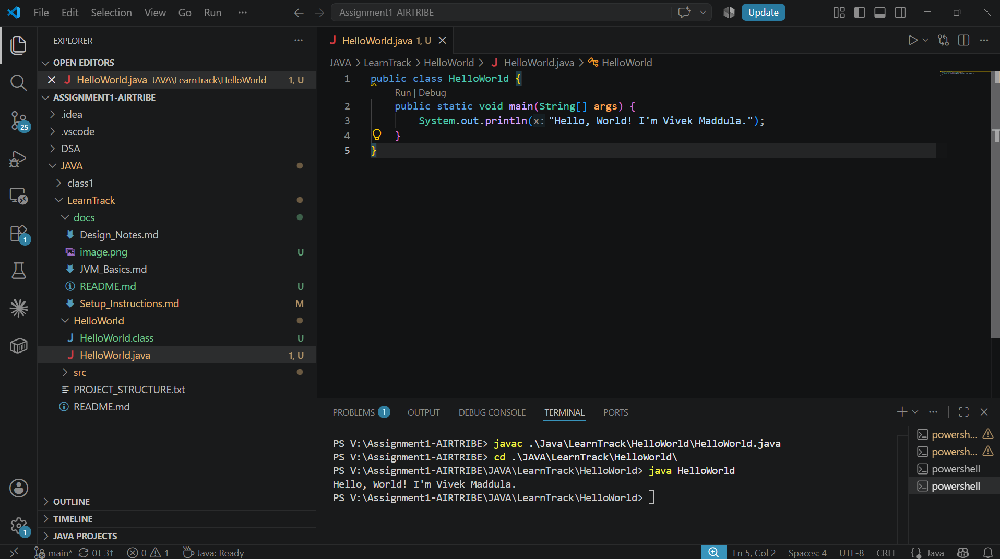

- JDK version used : Java 25.0.4 LTS (OpenJDK Temurin) 

- Screenshots or brief explanation of “Hello World” program run.

- Steps:
1. Write code in 'HelloWorld.java'
2. Compile: 'javac HelloWorld.java'
3. cd into appropriate folder
3. Run: 'java HelloWorld'
4. Expected Output: 'Hello, World! I'm Vivek Maddula'

